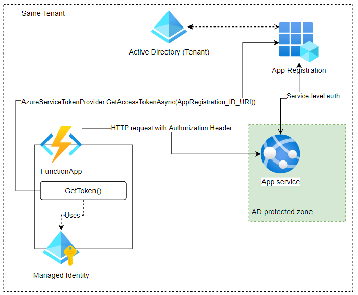

# Scenario
This sample demonstrates the following situation:
We want to call a Web API running on Azure App service from an Azure Function app.  
The App service is secured by Azure Active Directory, so in order to call it's endpoints, we need to send http request with Authorization headers.  
In this sample we will use the Azure Function App's managed identity to request access token from the configured App registration of the Web API.

I hope the picture explains this better:


  

# Content
## Infrastructure as Code solution 
Terraform solution for creating the required Azure resources:
- resource group
- web app (service plan, app service, app registration)
- function app (storage account, service plan, function app)

## Function app
Basic Function app with an http triggered function named `CallWebApi`. This will send and authenticated get request to the API's `weatherforecast` endpoint.

## WebApi
Basically the `minimal web api` sample from the dotnet team with some modifications. Provides swagger ui just to play with it, and `GET/POST wheaterforecast` endpoint.

## How to run this?
The terraform solution can be deployed by just executing the following commands in the `IaC/tf` path.
```sh
    az login # login to your tenant
    terraform init 
    terraform apply --auto-approve
```
The Web Portal and Function app deployment is not "automated" in this solution, publishing them from VS or VSCode should work ;).

# Key points
## App registratoin
- defines a unique identifier URI
    - Usually this is something like `API://{AppReg's client id}` but can be any globally unique value, so this solution uses the App's URL.
        - **This is the "thing" we need in accessTokenRequest(*APP_UNIQUE_URI*) calls**
    - Uses AccessTokenVersion 2
## Function App
- Uses Managed Identity to request access token:
    ```csharp
    var azServiceTokenProvider = new AzureServiceTokenProvider();
    var token = await azServiceTokenProvider.GetAccessTokenAsync(webPortalResource);
    return token;
    ```
- Add's this token to the Authorization header of the HttpClient requests
    ```csharp 
    var token = await GetToken(log);
    client.DefaultRequestHeaders.Authorization = 
                                new AuthenticationHeaderValue("Bearer", token);
    ```